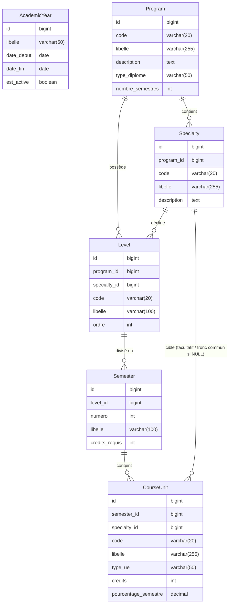

# Plan d'Implémentation : Structure Académique (jusqu'à l'UE) — Laravel 13 & Blade

Ce document présente le plan de reconstruction/migration de la structure académique sous **Laravel 13** en utilisant des contrôleurs standard, des requêtes de validation (Form Requests) et des vues **Blade** (sans Livewire). Il intègre également le système de gestion de l'activation et de la désactivation de l'Année Académique.

> ⚠️ **Anti-pattern N+1** : toutes les corrections Eager Loading ont été appliquées dans ce plan. Activer `Model::preventLazyLoading(!app()->isProduction())` dans `AppServiceProvider::boot()` pour détecter tout N+1 résiduel en développement.

---

## 1. Analyse Conceptuelle & Schéma Relationnel

Le diagramme ci-dessous illustre la hiérarchie et les relations requises entre les entités académiques (Année, Filière, Spécialité, Niveau, Semestre, UE).



---

## 2. Guide Détaillé des Relations à Utiliser

Pour assurer l'intégrité et la cohérence de l'application, voici les relations Eloquent indispensables à implémenter :

### A. Relations de `AcademicYear` (Année Académique)
- **`courseGroups()`** (`HasMany` vers `CourseGroup`) : Permet de lister les groupes d'étudiants (classes) créés pour cette année spécifique.
- **`students()`** (`HasMany` ou `BelongsToMany` selon l'implémentation globale) : Permet de suivre les inscriptions d'étudiants pour l'année.

### B. Relations de `Program` (Filière)
- **`specialties()`** (`HasMany` vers `Specialty`) : Une filière contient plusieurs spécialités (ex: Filière *Génie Informatique* possède *Génie Logiciel* et *Réseaux*).
- **`levels()`** (`HasMany` vers `Level`) : Liste les différents niveaux d'études de la filière (ex: L1, L2, L3).

### C. Relations de `Specialty` (Spécialité)
- **`program()`** (`BelongsTo` vers `Program`) : Permet de remonter à la filière parente.
- **`levels()`** (`HasMany` vers `Level`) : Liste les niveaux d'études qui sont spécifiques à cette option.
- **`courseUnits()`** (`HasMany` vers `CourseUnit`) : Permet de cibler les UE rattachées exclusivement à cette spécialité.

### D. Relations de `Level` (Niveau)
- **`program()`** (`BelongsTo` vers `Program`) : La filière associée à ce niveau.
- **`specialty()`** (`BelongsTo` vers `Specialty`, nullable) : La spécialité associée, facultative si le niveau est commun à toute la filière.
- **`semesters()`** (`HasMany` vers `Semester`) : Les semestres de cette année d'étude (généralement 2 semestres par niveau).

### E. Relations de `Semester` (Semestre)
- **`level()`** (`BelongsTo` vers `Level`) : Le niveau parent contenant ce semestre.
- **`courseUnits()`** (`HasMany` vers `CourseUnit`) : Les unités d'enseignement dispensées durant ce semestre.

### F. Relations de `CourseUnit` (Unité d'Enseignement / UE)
- **`semester()`** (`BelongsTo` vers `Semester`) : Le semestre dans lequel l'UE est enseignée.
- **`specialty()`** (`BelongsTo` vers `Specialty`, nullable) : Si `null`, cette UE fait partie du tronc commun (partagé par tous les étudiants du niveau). Si renseigné, elle est réservée à cette spécialité.
- **`courses()`** (`HasMany` vers `Course`) : Liste les matières (ou éléments constitutifs - ECU) composant cette UE.

---

## 3. Système d'Activation/Désactivation de l'Année Académique

Ce système garantit qu'**une seule année académique peut être active à la fois**. 

### A. Fonctionnement au niveau Modèle (Événements Boot)
Le modèle `AcademicYear` utilise les hooks de cycle de vie Eloquent pour désactiver automatiquement les autres années lorsqu'une nouvelle année est créée ou mise à jour avec le statut actif.

```php
// app/Models/Academic/AcademicYear.php

protected static function boot(): void
{
    parent::boot();

    // Lors de la création d'une année active
    // ✅ Fix N+1/perf : WHERE sur est_active=true évite un UPDATE global inutile
    static::creating(function ($academicYear): void {
        if ($academicYear->est_active) {
            static::where('est_active', true)
                ->update(['est_active' => false]);
        }
    });

    // Lors de la mise à jour (activation) d'une année
    // ✅ Fix N+1 : double filtre (id != current ET est_active=true) pour ne cibler que les actives
    static::updating(function ($academicYear): void {
        if ($academicYear->est_active && $academicYear->isDirty('est_active')) {
            static::where('id', '!=', $academicYear->id)
                ->where('est_active', true)
                ->update(['est_active' => false]);
        }
    });
}

// Méthodes utilitaires d'activation/désactivation
public function activate(): bool
{
    return $this->update(['est_active' => true]);
}

public function deactivate(): bool
{
    return $this->update(['est_active' => false]);
}
```

### B. Routes Dédiées (`routes/web.php`)
```php
use App\Http\Controllers\Academic\AcademicYearController;

Route::prefix('academic')->name('academic.')->group(function () {
    Route::resource('academic-years', AcademicYearController::class);
    
    // Actions d'activation et désactivation
    Route::post('academic-years/{academicYear}/activate', [AcademicYearController::class, 'activate'])
        ->name('academic-years.activate');
    Route::post('academic-years/{academicYear}/deactivate', [AcademicYearController::class, 'deactivate'])
        ->name('academic-years.deactivate');
});
```

### C. Actions dans le Contrôleur (`AcademicYearController.php`)
```php
public function activate(AcademicYear $academicYear)
{
    $academicYear->activate();
    return redirect()->back()->with('success', "L'année académique {$academicYear->libelle} a été activée.");
}

public function deactivate(AcademicYear $academicYear)
{
    $academicYear->deactivate();
    return redirect()->back()->with('success', "L'année académique {$academicYear->libelle} a été désactivée.");
}
```

---

## 4. Plan de Reconstruction Étape par Étape

### Étape 0 : Prévention des N+1 (AppServiceProvider)

Ajouter **en priorité** dans `app/Providers/AppServiceProvider.php` pour détecter automatiquement tout lazy loading non autorisé en développement :

```php
use Illuminate\Database\Eloquent\Model;

public function boot(): void
{
    // ✅ Lève une exception à chaque accès lazy à une relation non chargée (dev uniquement)
    Model::preventLazyLoading(! app()->isProduction());
}
```

---

### Étape 1 : Les Migrations

Créez les tables dans l'ordre suivant :
1. `academic_years`
2. `programs`
3. `specialties`
4. `levels` (avec clé unique composite `['program_id', 'specialty_id', 'ordre']`)
5. `semesters` (avec clé unique composite `['level_id', 'numero']`)
6. `course_units` (avec `specialty_id` nullable)

---

### Étape 2 : Définition des Modèles & Relations
Assurez-vous de définir toutes les relations détaillées dans la **section 2** au sein des classes correspondantes sous `App\Models\Academic`.

---

### Étape 3 : Implémentation des Contrôleurs

#### 3.a — `AcademicYearController.php`

```php
namespace App\Http\Controllers\Academic;

use App\Http\Controllers\Controller;
use App\Models\Academic\AcademicYear;

class AcademicYearController extends Controller
{
    // ✅ Fix N+1 : paginate() au lieu de all() — évite de charger toutes les années en mémoire
    public function index()
    {
        $academicYears = AcademicYear::orderByDesc('date_debut')->paginate(15);
        return view('academic.academic-years.index', compact('academicYears'));
    }

    public function activate(AcademicYear $academicYear)
    {
        $academicYear->activate();
        return redirect()->back()->with('success', "L'année académique {$academicYear->libelle} a été activée.");
    }

    public function deactivate(AcademicYear $academicYear)
    {
        $academicYear->deactivate();
        return redirect()->back()->with('success', "L'année académique {$academicYear->libelle} a été désactivée.");
    }
}
```

#### 3.b — `CourseUnitController.php`

```php
namespace App\Http\Controllers\Academic;

use App\Http\Controllers\Controller;
use App\Models\Academic\CourseUnit;
use App\Models\Academic\Semester;
use App\Models\Academic\Specialty;
use Illuminate\Http\Request;

class CourseUnitController extends Controller
{
    /**
     * ✅ Fix N+1 : méthode privée factorisée pour les données de formulaire.
     * Évite de répéter les mêmes requêtes dans create() et edit().
     * Sélection des colonnes minimales nécessaires pour les <select>.
     */
    private function getFormData(): array
    {
        return [
            'semesters'   => Semester::with('level.program')
                                ->orderBy('numero')
                                ->get(['id', 'libelle', 'numero', 'level_id']),
            'specialties' => Specialty::with('program')
                                ->orderBy('libelle')
                                ->get(['id', 'libelle', 'program_id']),
        ];
    }

    public function index(Request $request)
    {
        $search      = $request->input('search');
        $specialtyId = $request->input('specialty_id');

        // ✅ Fix N+1 : with() couvre TOUTES les relations accédées en vue Blade
        //   semester             → $courseUnit->semester->libelle
        //   semester.level       → $courseUnit->semester->level->libelle
        //   semester.level.program → $courseUnit->semester->level->program->libelle
        //   specialty            → $courseUnit->specialty->libelle (nullable)
        $courseUnits = CourseUnit::with([
                'semester',
                'semester.level',
                'semester.level.program',
                'specialty',
            ])
            ->when($search, function ($query, $search) {
                $query->where('libelle', 'like', "%{$search}%")
                      ->orWhere('code', 'like', "%{$search}%");
            })
            ->when($specialtyId, function ($query, $specialtyId) {
                $query->where('specialty_id', $specialtyId);
            })
            ->paginate(10);

        // ✅ Fix N+1 : sélection minimale des colonnes pour le filtre du formulaire
        $specialties = Specialty::orderBy('libelle')->get(['id', 'libelle']);

        return view('academic.course-units.index', compact('courseUnits', 'specialties'));
    }

    public function create()
    {
        // ✅ Fix N+1 : données factorisées via getFormData()
        return view('academic.course-units.create', $this->getFormData());
    }

    public function store(Request $request)
    {
        $validated = $request->validate([
            'semester_id'          => 'required|exists:semesters,id',
            'specialty_id'         => 'nullable|exists:specialties,id',
            'code'                 => 'required|string|max:20|unique:course_units,code',
            'libelle'              => 'required|string|max:255',
            'type_ue'              => 'required|string',
            'credits'              => 'required|integer|min:1',
            'pourcentage_semestre' => 'nullable|numeric|min:0|max:100',
        ]);

        CourseUnit::create($validated);

        return redirect()->route('academic.course-units.index')
            ->with('success', 'L\'Unité d\'Enseignement a bien été créée.');
    }

    public function edit(CourseUnit $courseUnit)
    {
        // ✅ Fix N+1 : données factorisées via getFormData() — même requête que create()
        return view('academic.course-units.edit', array_merge(
            ['courseUnit' => $courseUnit],
            $this->getFormData()
        ));
    }

    public function update(Request $request, CourseUnit $courseUnit)
    {
        $validated = $request->validate([
            'semester_id'          => 'required|exists:semesters,id',
            'specialty_id'         => 'nullable|exists:specialties,id',
            'code'                 => 'required|string|max:20|unique:course_units,code,' . $courseUnit->id,
            'libelle'              => 'required|string|max:255',
            'type_ue'              => 'required|string',
            'credits'              => 'required|integer|min:1',
            'pourcentage_semestre' => 'nullable|numeric|min:0|max:100',
        ]);

        $courseUnit->update($validated);

        return redirect()->route('academic.course-units.index')
            ->with('success', 'L\'Unité d\'Enseignement a bien été modifiée.');
    }

    public function destroy(CourseUnit $courseUnit)
    {
        $courseUnit->delete();

        return redirect()->route('academic.course-units.index')
            ->with('success', 'L\'Unité d\'Enseignement a été supprimée avec succès.');
    }
}
```

---

### Étape 4 : Les Vues Blade (Formulaires d'activation / UE)

> ✅ **Règle N+1 en Blade** : n'accéder en vue qu'aux relations **explicitement déclarées dans le `with()`** du contrôleur. Toute relation non chargée déclenchera une exception si `preventLazyLoading` est activé.

#### Liste des Années Académiques avec boutons d'activation (`resources/views/academic/academic-years/index.blade.php`)
```html
@extends('layouts.app')

@section('content')
<div class="p-6">
    <h1 class="text-2xl font-bold mb-4">Gestion des Années Académiques</h1>
    
    <table class="w-full bg-white rounded shadow text-left">
        <thead>
            <tr class="bg-gray-100 border-b">
                <th class="p-3">Libellé</th>
                <th class="p-3">Période</th>
                <th class="p-3">Statut Actif</th>
                <th class="p-3 text-right">Actions</th>
            </tr>
        </thead>
        <tbody>
            @foreach($academicYears as $year)
                <tr class="border-b">
                    <td class="p-3">{{ $year->libelle }}</td>
                    <td class="p-3">{{ $year->getFormattedPeriod() }}</td>
                    <td class="p-3">
                        @if($year->est_active)
                            <span class="bg-green-100 text-green-800 text-xs px-2.5 py-0.5 rounded font-bold">Active</span>
                        @else
                            <span class="bg-gray-100 text-gray-800 text-xs px-2.5 py-0.5 rounded">Inactive</span>
                        @endif
                    </td>
                    <td class="p-3 text-right">
                        @if($year->est_active)
                            <form action="{{ route('academic.academic-years.deactivate', $year) }}" method="POST" class="inline">
                                @csrf
                                <button type="submit" class="bg-yellow-500 hover:bg-yellow-600 text-white text-xs px-3 py-1 rounded">
                                    Désactiver
                                </button>
                            </form>
                        @else
                            <form action="{{ route('academic.academic-years.activate', $year) }}" method="POST" class="inline">
                                @csrf
                                <button type="submit" class="bg-green-600 hover:bg-green-700 text-white text-xs px-3 py-1 rounded">
                                    Activer
                                </button>
                            </form>
                        @endif
                    </td>
                </tr>
            @endforeach
        </tbody>
    </table>

    {{-- ✅ Fix N+1 : liens de pagination Blade (nécessaire avec paginate()) --}}
    <div class="mt-4">
        {{ $academicYears->links() }}
    </div>
</div>
@endsection
```

---

## 5. Récapitulatif des Corrections N+1 Appliquées

| Fichier | Correction appliquée |
|---|---|
| `AppServiceProvider` | `preventLazyLoading(!isProduction())` activé |
| `AcademicYear::boot()` | `->where('est_active', true)` ajouté avant chaque `update()` |
| `AcademicYearController::index()` | `->paginate(15)` au lieu de `->all()` + liens de pagination |
| `CourseUnitController::index()` | `with()` explicite sur toutes les relations utilisées en vue |
| `CourseUnitController::create/edit()` | Factorisé en `getFormData()` — évite la duplication de requêtes |
| `Specialty` dans les selects | `->get(['id', 'libelle'])` — colonnes minimales uniquement |
| `Semester` dans les selects | `->get(['id', 'libelle', 'numero', 'level_id'])` — colonnes minimales |
